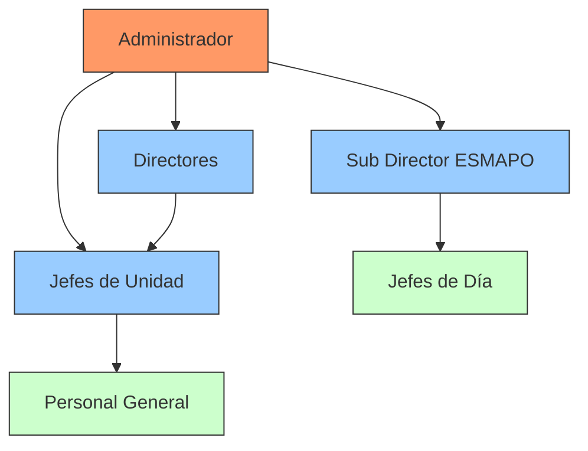
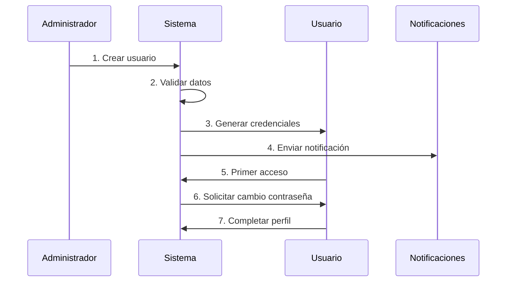
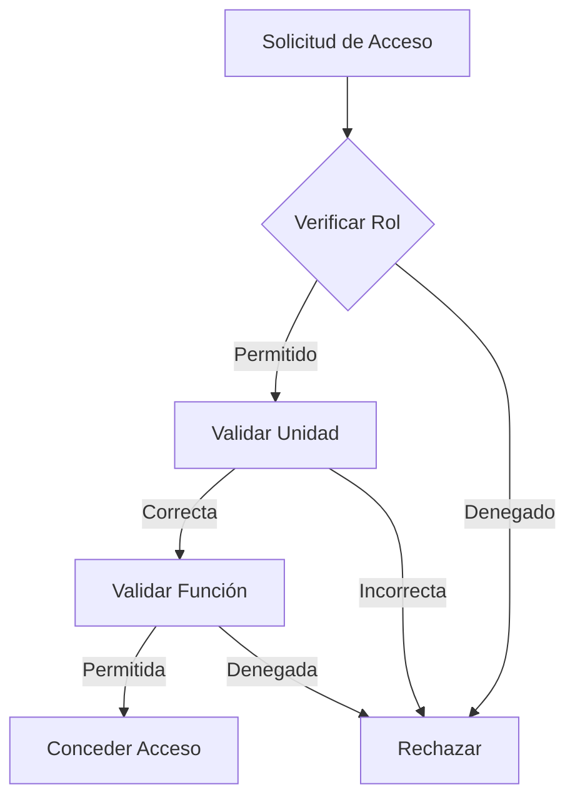
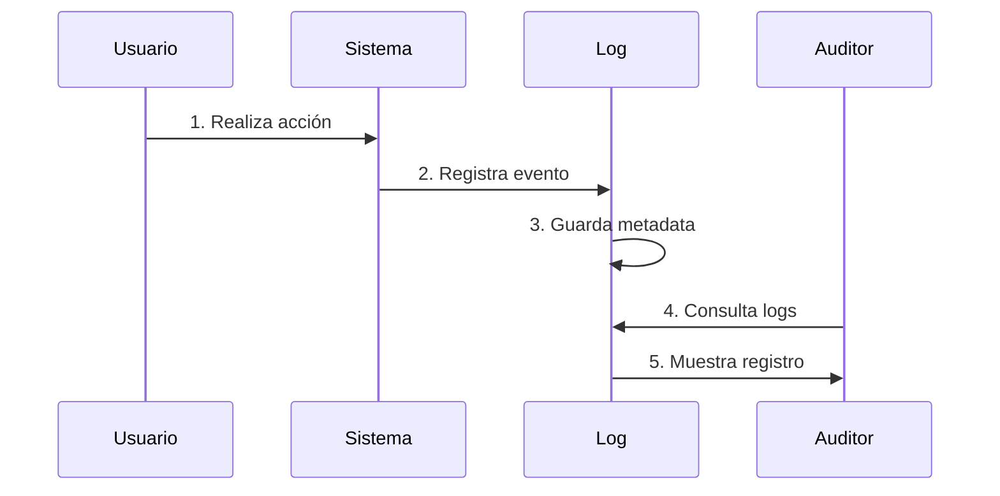

# Usuarios

## Descripción General
La página de Gestión de Usuarios permite administrar los usuarios del sistema SIPROD, incluyendo la creación, edición, visualización y eliminación de usuarios. Esta página está disponible solo para usuarios con rol de Administrador.

## Jerarquía de Roles

### Diagrama de Roles


### Ejemplo de Permisos por Rol
Caso: Gestión de Turnos de Jefe de Día

1. **Administrador (Cnel. Roberto Pérez)**
   - Acceso total al sistema ✓
   - Crear/modificar roles ✓
   - Gestionar todos los usuarios ✓
   - Ver todas las unidades ✓

2. **Sub Director ESMAPO (Cnel. María González)**
   - Gestionar Escalafón ✓
   - Asignar turnos ✓
   - Ver todas las unidades ✓
   - Modificar roles ✗

3. **Director de Unidad (May. Carlos Rodríguez)**
   - Ver su unidad ✓
   - Gestionar personal ✓
   - Asignar turnos ✗
   - Crear usuarios ✗

## Flujo de Creación de Usuario

### Diagrama de Proceso


### Ejemplo de Creación de Usuario
Caso: Alta del Cap. Juan Martínez

1. **Datos Iniciales** (06/02/2025):
   - Nombre: Juan Martínez
   - Grado: Capitán
   - CI: 4.123.456-7
   - Unidad: URGE Centro
   - Rol: Jefe de Día

2. **Validaciones**:
   - CI única en sistema ✓
   - Grado verificado ✓
   - Unidad existe ✓
   - Permisos correctos ✓

3. **Activación**:
   - Credenciales generadas
   - Email enviado
   - Perfil creado
   - Permisos asignados

## Gestión de Permisos

### Diagrama de Validación


### Ejemplo de Control de Acceso
Caso: Acceso a Información de Unidad

1. **Usuario: May. Laura Sánchez**
   - Rol: Director de Unidad
   - Unidad: URGE Norte
   - Intenta acceder a:
     * Datos de personal ✓
     * Estadísticas unidad ✓
     * Escalafón general ✗
     * Otras unidades ✗

2. **Restricciones Aplicadas**:
   - Solo ve URGE Norte
   - No modifica turnos
   - No crea usuarios
   - Ve reportes limitados

## Auditoría y Seguridad

### Diagrama de Auditoría


### Ejemplo de Registro de Auditoría
Caso: Modificación de Permisos

1. **Evento Registrado**:
   - Fecha: 06/02/2025 14:30
   - Usuario: Cnel. Roberto Pérez
   - Acción: Modificar permisos
   - Afectado: Cap. Juan Martínez
   - Cambios:
     * +Acceso Escalafón
     * -Gestión Servicios 222
     * +Ver Estadísticas

2. **Metadata Guardada**:
   - IP: 192.168.1.100
   - Navegador: Chrome 121.0
   - Sesión: #A7B2C3D4
   - Duración: 45 segundos

## Recomendaciones Técnicas

### Mejores Prácticas
1. Verificar identidad antes de cambios críticos
2. Mantener logs detallados
3. Actualizar permisos regularmente
4. Revisar accesos periódicamente

### Optimizaciones
1. Caché de permisos frecuentes
2. Validaciones en tiempo real
3. Notificaciones inmediatas
4. Sincronización automática

## ¿Necesitas Ayuda?
- Manual de administrador: `/docs/admin`
- Guía de permisos: `/docs/permisos`
- Soporte técnico: `/help`

## Estructura de Datos

### Grados Jerárquicos
```typescript
enum Grado {
  CTE_MAYOR = 'Comandante Mayor',
  CTE = 'Comandante',
  MAY = 'Mayor',
  CAP = 'Capitán',
  TTE_1RO = 'Teniente Primero',
  TTE = 'Teniente',
  ALF = 'Alférez',
  SGTO_1RO = 'Sargento Primero',
  SGTO = 'Sargento',
  CABO_1RO = 'Cabo Primero',
  CABO_2DO = 'Cabo Segundo',
  CABO = 'Cabo',
  AG_1RA = 'Agente Primera',
  AG_2DA = 'Agente Segunda',
  CADETE = 'Cadete'
}
```

### Roles del Sistema
```typescript
enum Rol {
  ADMINISTRADOR = 'Administrador',
  SUPERVISOR = 'Supervisor',
  OPERADOR = 'Operador',
  COMANDO_DIRECCION_I = 'Comando Dirección I',
  COMANDO_DIRECCION_II = 'Comando Dirección II',
  COMANDO_GEO = 'Comando GEO',
  COMANDO_DNGR = 'Comando DNGR'
}
```

### Estructura de Usuario
```typescript
interface User {
  id: string;                      // Identificador único
  createdAt: string;              // Fecha de creación
  ultimaFechaAcceso: string;      // Último acceso al sistema
  contrasenaActual: string;       // Contraseña actual (hash)
  nuevaContrasena?: string;       // Nueva contraseña (opcional)
  grado: Grado;                   // Grado jerárquico
  nombre: string;                 // Nombre completo
  rol: Rol;                       // Rol en el sistema
  cargo: string;                  // Cargo o función
  correo: string;                 // Correo electrónico
  terminosCondiciones: boolean;   // Aceptación de términos
  desplieguesCargados: number;    // Número de despliegues
  activo: boolean;               // Estado del usuario
  updatedAt: string;             // Última actualización
}
```

## Funcionalidades Principales

### 1. Listado de Usuarios
- Visualización en tabla con paginación
- Columnas principales:
  - Nombre completo
  - Grado
  - Rol
  - Cargo
  - Estado (activo/inactivo)
  - Acciones (editar/eliminar)

### 2. Creación de Usuario
- Formulario con validación en tiempo real
- Campos requeridos:
  - Nombre completo
  - Correo electrónico
  - Contraseña
  - Grado jerárquico
  - Rol del sistema
  - Cargo
- Campos opcionales:
  - Términos y condiciones
  - Estado activo/inactivo

### 3. Edición de Usuario
- Modificación de datos existentes
- Cambio de contraseña opcional
- Actualización de rol y permisos
- Activación/desactivación de cuenta

### 4. Eliminación de Usuario
- Confirmación requerida
- Registro de auditoría
- Desactivación en lugar de eliminación física

## Ejemplos de Uso

### Crear Nuevo Usuario
```typescript
const nuevoUsuario = {
  nombre: "María González",
  correo: "maria.gonzalez@policia.gob.ar",
  contrasenaActual: "********",
  grado: Grado.CAP,
  rol: Rol.SUPERVISOR,
  cargo: "Supervisora de Turno",
  terminosCondiciones: true,
  activo: true
};
```

### Editar Usuario Existente
```typescript
const usuarioEditado = {
  ...usuarioExistente,
  rol: Rol.COMANDO_GEO,
  cargo: "Jefe de Operaciones GEO",
  activo: true
};
```

## Gestión de Errores

### Validaciones
- Correo electrónico único en el sistema
- Contraseña con requisitos mínimos de seguridad
- Campos obligatorios completos
- Formato de correo válido

### Mensajes de Error
- Errores de validación en tiempo real
- Mensajes claros y específicos
- Sugerencias de corrección

## Auditoría y Seguridad

### Registro de Cambios
- Fecha y hora de modificaciones
- Usuario que realizó cambios
- Tipo de cambio realizado
- Valores anteriores y nuevos

### Control de Acceso
- Solo administradores pueden:
  - Crear nuevos usuarios
  - Modificar roles
  - Desactivar cuentas
  - Ver listado completo

## Flujo de Trabajo

1. **Acceso a la Página**
   - Verificación de permisos
   - Carga inicial de datos

2. **Gestión de Usuarios**
   - Visualización de lista
   - Búsqueda y filtrado
   - Acciones de gestión

3. **Operaciones CRUD**
   - Validación de datos
   - Confirmación de acciones
   - Actualización de lista

4. **Cierre de Sesión**
   - Limpieza de estado
   - Redirección segura
