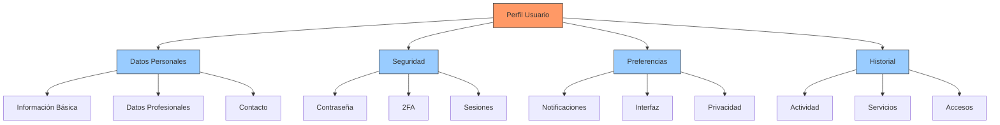
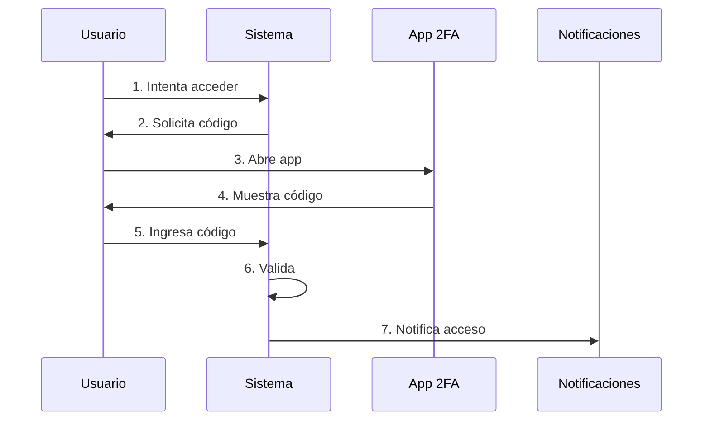
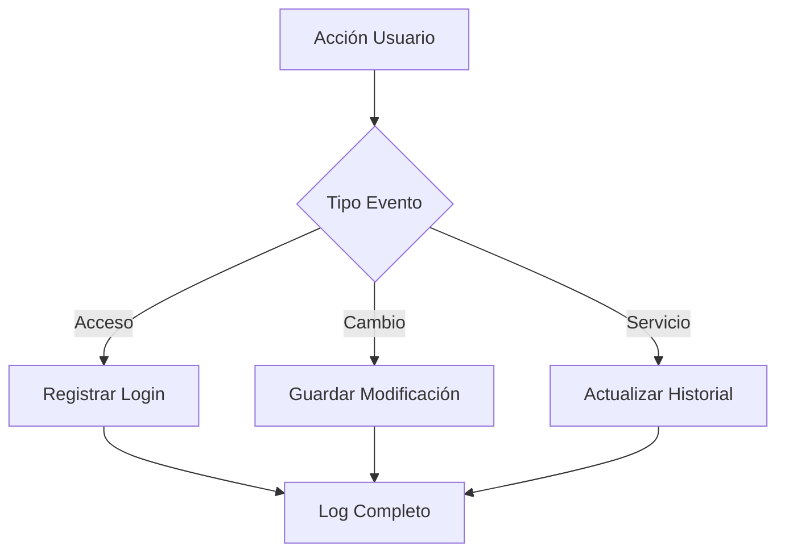
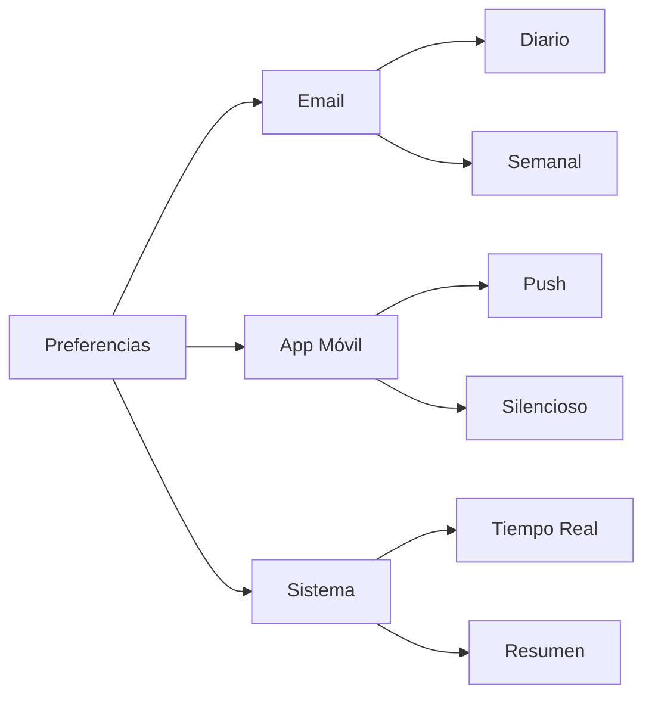

# Perfil

## Descripción General
Página personal que permite a cada usuario visualizar y gestionar su información personal, preferencias del sistema y acceder a su historial de actividades.

## Estructura del Perfil

### Diagrama de Secciones


### Ejemplo de Perfil Completo
Caso: Perfil del Cap. María Torres

1. **Datos Personales**:
   - Nombre: María Torres
   - CI: 3.234.567-8
   - Grado: Capitán
   - Unidad: URGE Sur
   - Email: mtorres@guardia.gub.uy

2. **Datos Profesionales**:
   - Cargo: Jefe de Día
   - Antigüedad: 8 años
   - Especialidad: Táctica
   - Habilitaciones: S222, Jefe de Día

## Gestión de Seguridad

### Diagrama de Proceso 2FA


### Ejemplo de Gestión de Seguridad
Caso: Activación 2FA del Cap. María Torres

1. **Configuración Inicial**:
   - Fecha: 06/02/2025
   - Dispositivo: iPhone 14
   - App: Google Authenticator
   - Backup: Códigos de respaldo generados

2. **Proceso de Activación**:
   - Escaneo de QR ✓
   - Validación de código ✓
   - Backup guardado ✓
   - Email confirmación enviado ✓

## Historial de Actividad

### Diagrama de Registro


### Ejemplo de Historial
Caso: Actividad reciente del Cap. María Torres

1. **Accesos Recientes**:
   ```
   06/02/2025 09:15 - Login exitoso (Chrome/Windows)
   06/02/2025 13:20 - Cambio de contraseña
   06/02/2025 13:25 - Activación 2FA
   06/02/2025 14:10 - Actualización de perfil
   ```

2. **Servicios del Mes**:
   - 01/02: Turno Jefe de Día ✓
   - 05/02: Servicio 222 Terminal ✓
   - 10/02: Curso Táctico (Pendiente)
   - 15/02: Turno Jefe de Día (Programado)

## Preferencias y Notificaciones

### Diagrama de Configuración


### Ejemplo de Configuración
Caso: Preferencias del Cap. María Torres

1. **Notificaciones**:
   - Email: Resumen diario ✓
   - App: Alertas inmediatas ✓
   - Sistema: Tiempo real ✓
   - Sonidos: Activados ✓

2. **Interfaz**:
   - Tema: Oscuro
   - Idioma: Español
   - Vista calendario: Mensual
   - Dashboard: Personalizado

## Recomendaciones Técnicas

### Mejores Prácticas
1. Actualizar datos regularmente
2. Verificar dispositivos conectados
3. Revisar historial de accesos
4. Mantener 2FA activo

### Optimizaciones
1. Caché de datos frecuentes
2. Validaciones en tiempo real
3. Compresión de historial
4. Limpieza automática

## ¿Necesitas Ayuda?
- Guía de usuario: `/docs/perfil`
- FAQ: `/docs/faq`
- Soporte: `/help`
