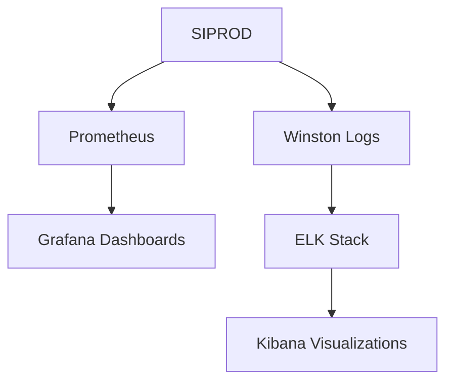

# Guía de Operaciones SIPROD

## Tabla de Contenidos

1. [Monitoreo](#monitoreo)
2. [Logs](#logs)
3. [Seguridad](#seguridad)
4. [Troubleshooting](#troubleshooting)
5. [Mantenimiento](#mantenimiento)

## Monitoreo

### Stack de Monitoreo



### Métricas Principales

```typescript
// config/metrics.ts
import { Registry, collectDefaultMetrics } from 'prom-client';

export const register = new Registry();
collectDefaultMetrics({ register });

// Métricas personalizadas
export const httpRequestDuration = new register.Histogram({
  name: 'http_request_duration_seconds',
  help: 'Duración de las solicitudes HTTP',
  labelNames: ['method', 'route', 'status_code'],
  buckets: [0.1, 0.5, 1, 2, 5],
});

export const activeUsers = new register.Gauge({
  name: 'siprod_active_users',
  help: 'Número de usuarios activos',
});

export const errorRate = new register.Counter({
  name: 'siprod_errors_total',
  help: 'Total de errores',
  labelNames: ['type'],
});
```

### Dashboard de Grafana

```json
{
  "dashboard": {
    "id": null,
    "title": "SIPROD Dashboard",
    "panels": [
      {
        "title": "Solicitudes por minuto",
        "type": "graph",
        "datasource": "Prometheus",
        "targets": [
          {
            "expr": "rate(http_request_duration_seconds_count[1m])",
            "legendFormat": "{{method}} {{route}}"
          }
        ]
      },
      {
        "title": "Usuarios Activos",
        "type": "gauge",
        "datasource": "Prometheus",
        "targets": [
          {
            "expr": "siprod_active_users"
          }
        ]
      }
    ]
  }
}
```

## Logs

### Configuración de Winston

```typescript
// config/logger.ts
import winston from 'winston';

export const logger = winston.createLogger({
  level: process.env.LOG_LEVEL || 'info',
  format: winston.format.combine(
    winston.format.timestamp(),
    winston.format.json()
  ),
  defaultMeta: { service: 'siprod-api' },
  transports: [
    // Logs de error
    new winston.transports.File({
      filename: 'logs/error.log',
      level: 'error',
      maxsize: 5242880, // 5MB
      maxFiles: 5,
    }),
    // Logs combinados
    new winston.transports.File({
      filename: 'logs/combined.log',
      maxsize: 5242880,
      maxFiles: 5,
    }),
    // Logs de desarrollo
    ...(process.env.NODE_ENV !== 'production'
      ? [new winston.transports.Console()]
      : []),
  ],
});
```

### Estructura de Logs

```typescript
// Ejemplo de log estructurado
logger.info('Usuario autenticado', {
  userId: '123',
  action: 'LOGIN',
  timestamp: new Date().toISOString(),
  metadata: {
    ip: req.ip,
    userAgent: req.headers['user-agent'],
  },
});
```

## Seguridad

### Protecciones Implementadas

1. **Rate Limiting**
```typescript
export const rateLimiter = rateLimit({
  windowMs: 15 * 60 * 1000,
  max: 100,
  keyGenerator: (req) => {
    return req.ip || req.user?.id;
  }
});
```

2. **Validación de Entrada**
```typescript
export const createUserSchema = z.object({
  email: z.string().email(),
  password: z.string().min(8),
  role: z.enum(['USER', 'ADMIN'])
});
```

3. **Headers de Seguridad**
```typescript
app.use(helmet());
app.use(cors({
  origin: process.env.ALLOWED_ORIGINS?.split(','),
  credentials: true
}));
```

### Políticas de Autenticación

1. **JWT**
```typescript
const verifyToken = (token: string): JWTPayload => {
  try {
    return jwt.verify(token, process.env.JWT_SECRET);
  } catch (error) {
    throw new UnauthorizedError();
  }
};
```

2. **Sesiones**
```typescript
app.use(session({
  store: new RedisStore({ client: redisClient }),
  secret: process.env.SESSION_SECRET,
  resave: false,
  saveUninitialized: false,
  cookie: {
    secure: process.env.NODE_ENV === 'production',
    httpOnly: true,
    maxAge: 24 * 60 * 60 * 1000 // 24 horas
  }
}));
```

## Troubleshooting

### Problemas Comunes y Soluciones

1. **Conexión a Base de Datos**
```sql
-- Verificar conexiones activas
SELECT * FROM pg_stat_activity;

-- Reiniciar conexiones si necesario
SELECT pg_terminate_backend(pid) 
FROM pg_stat_activity 
WHERE datname = 'siprod';
```

2. **Problemas de Caché**
```typescript
// Limpiar caché de Redis
await redisClient.flushdb();

// Verificar estado de Redis
const info = await redisClient.info();
console.log(info);
```

3. **Errores de Memoria**
```bash
# Verificar uso de memoria
pm2 monit

# Reiniciar servicio si necesario
pm2 reload siprod-api
```

### Lista de Verificación para Incidentes

1. Verificar logs de error
2. Comprobar métricas en Grafana
3. Validar conectividad de servicios
4. Revisar uso de recursos
5. Verificar estado de caché

## Mantenimiento

### Rotación de Logs

```bash
# /etc/logrotate.d/siprod
/var/log/siprod/*.log {
    daily
    rotate 14
    compress
    delaycompress
    notifempty
    create 0640 siprod siprod
    sharedscripts
    postrotate
        /usr/bin/systemctl reload siprod
    endscript
}
```

### Backups

```bash
# Backup de base de datos
pg_dump -U postgres siprod > backup_$(date +%Y%m%d).sql

# Backup de logs
tar -czf logs_$(date +%Y%m%d).tar.gz /var/log/siprod/
```

### Limpieza de Datos

```typescript
async function cleanupOldData() {
  const thirtyDaysAgo = subDays(new Date(), 30);
  
  await prisma.auditLog.deleteMany({
    where: {
      createdAt: {
        lt: thirtyDaysAgo
      }
    }
  });
  
  await prisma.metrics.deleteMany({
    where: {
      timestamp: {
        lt: thirtyDaysAgo
      }
    }
  });
}
```

## Contactos de Emergencia

### NOC (24/7)
- Teléfono: +598 XXXXXXXX
- Email: noc@siprod.com
- Slack: #siprod-alerts

### Escalamiento
1. Nivel 1: Soporte Técnico
2. Nivel 2: DevOps
3. Nivel 3: Desarrollo
4. Nivel 4: Arquitectura

## Referencias

- [Prometheus Docs](https://prometheus.io/docs/introduction/overview/)
- [Grafana Docs](https://grafana.com/docs/)
- [ELK Stack Docs](https://www.elastic.co/guide/index.html)
- [Winston Docs](https://github.com/winstonjs/winston)

## Actualizaciones

Este documento se mantiene actualizado con cada cambio en la infraestructura o procedimientos operativos.