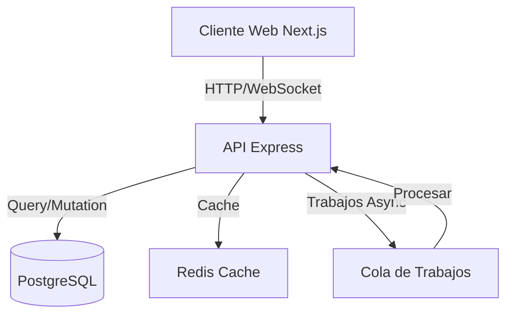

# Sistema de Gestión de Resultados Policiales y Recursos (SIPROD)

## Visión General

SIPROD es un sistema monorepo diseñado para centralizar y gestionar información policial crítica, facilitando la toma de decisiones, análisis estadístico y administración eficiente de recursos humanos y materiales.



## Estructura de Documentación

Esta documentación ha sido organizada en 5 documentos esenciales para maximizar la claridad y facilitar el acceso a la información:

1. [README.md](./README.md) - Este documento, visión general del proyecto y punto de entrada
2. [DESARROLLO.md](./DESARROLLO.md) - Guía completa para desarrollo, instalación, arquitectura y estándares
3. [API.md](./API.md) - Documentación detallada de endpoints, modelos y flujos de API
4. [OPERACIONES.md](./OPERACIONES.md) - Monitoreo, troubleshooting, seguridad y operaciones
5. [TESTING.md](./TESTING.md) - Estrategias, guías y mejores prácticas de testing

## Stack Tecnológico

### Frontend
- **Framework**: Next.js 14
- **Estado**: React Query + Context API
- **UI**: Material-UI + Emotion
- **API Client**: Axios + TypeScript

### Backend
- **Framework**: Express + TypeScript
- **ORM**: Prisma
- **Cache**: Redis
- **Auth**: JWT + Session

### DevOps
- **CI/CD**: GitHub Actions
- **Contenedores**: Docker
- **Monitoreo**: Prometheus + Grafana
- **Logs**: Winston + ELK Stack

## Inicio Rápido

```bash
# Instalación
git clone [repo-url]
cd siprod
pnpm install

# Configuración
cp .env.example .env
# Editar .env con tus credenciales

# Desarrollo
pnpm dev       # Inicia todos los servicios
pnpm dev:web   # Solo frontend
pnpm dev:api   # Solo backend
```

## Estructura del Proyecto

```
siprod/
├── apps/
│   ├── web/          # Frontend Next.js
│   ├── api/          # Backend Express
│   └── cache-server/ # Servidor Redis
├── packages/
│   ├── ui/           # Componentes compartidos
│   ├── config/       # Configuraciones compartidas
│   └── types/        # Types compartidos
└── docs/            # Documentación
```

## Flujo de Trabajo Git

- `main`: Producción
- `develop`: Desarrollo
- `feature/*`: Nuevas características
- `fix/*`: Correcciones
- `release/*`: Preparación para release

### Commits
```bash
<tipo>(<alcance>): <descripción>

# Ejemplos
feat(auth): implementar autenticación con JWT
fix(ui): corregir alineación en tabla principal
```

## Pre-requisitos

- Node.js >= 18.0.0
- pnpm >= 8.9.0
- PostgreSQL >= 15
- Redis >= 6

## Enlaces Útiles

- [Documentación API](./API.md)
- [Guía de Desarrollo](./DESARROLLO.md)
- [Documentación de Operaciones](./OPERACIONES.md)
- [Guía de Testing](./TESTING.md)
- [Confluence Wiki](https://siprod.atlassian.net/wiki)
- [Jira Board](https://siprod.atlassian.net/jira)

## Soporte

- Slack: #siprod-dev
- Email: soporte@siprod.com
- NOC (emergencias): +598 XXXXXXXX

## Licencia

Propiedad de Ministerio del Interior - República Oriental del Uruguay
Todos los derechos reservados