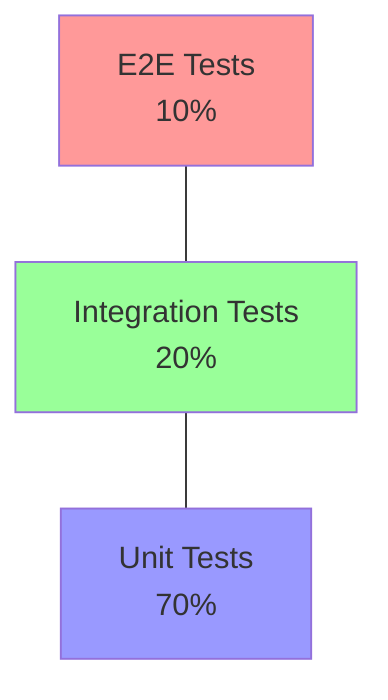

# Guía de Testing SIPROD

## Tabla de Contenidos

1. [Estrategias de Testing](#estrategias-de-testing)
2. [Pruebas Unitarias](#pruebas-unitarias)
3. [Pruebas de Integración](#pruebas-de-integración)
4. [Pruebas E2E](#pruebas-e2e)
5. [Testing de Frontend](#testing-de-frontend)
6. [Testing de Backend](#testing-de-backend)

## Estrategias de Testing

### Pirámide de Testing



### Configuración de Jest

```javascript
// jest.config.js
module.exports = {
  preset: 'ts-jest',
  testEnvironment: 'node',
  setupFilesAfterEnv: ['<rootDir>/jest.setup.ts'],
  moduleNameMapper: {
    '^@/(.*)$': '<rootDir>/src/$1',
  },
  coverageThreshold: {
    global: {
      branches: 80,
      functions: 80,
      lines: 80,
      statements: 80,
    },
  },
};
```

## Pruebas Unitarias

### Testing de Servicios

```typescript
// services/__tests__/user.service.test.ts
describe('UserService', () => {
  let userService: UserService;
  let mockUserRepo: jest.Mocked<UserRepository>;
  
  beforeEach(() => {
    mockUserRepo = {
      findById: jest.fn(),
      create: jest.fn(),
    } as any;
    
    userService = new UserService(mockUserRepo);
  });
  
  describe('createUser', () => {
    it('should create user with hashed password', async () => {
      const userData = {
        email: 'test@test.com',
        password: 'password123',
      };
      
      mockUserRepo.create.mockResolvedValue({
        ...userData,
        id: '1',
        password: 'hashed_password',
      });
      
      const result = await userService.createUser(userData);
      
      expect(mockUserRepo.create).toHaveBeenCalled();
      expect(result.password).not.toBe(userData.password);
    });
    
    it('should throw error for invalid email', async () => {
      const userData = {
        email: 'invalid-email',
        password: 'password123',
      };
      
      await expect(userService.createUser(userData))
        .rejects
        .toThrow('Invalid email');
    });
  });
});
```

### Testing de Utilidades

```typescript
// utils/__tests__/validation.test.ts
describe('validateEmail', () => {
  it.each([
    ['valid@email.com', true],
    ['invalid-email', false],
    ['user@domain', false],
    ['', false],
  ])('should validate email %s correctly', (email, expected) => {
    expect(validateEmail(email)).toBe(expected);
  });
});
```

## Pruebas de Integración

### Testing de API

```typescript
// tests/integration/auth.test.ts
describe('Auth Flow', () => {
  let app: Express;
  
  beforeAll(async () => {
    app = await createTestApp();
  });
  
  afterAll(async () => {
    await closeTestApp(app);
  });
  
  it('should authenticate user and return token', async () => {
    const credentials = {
      email: 'test@test.com',
      password: 'password123',
    };
    
    const response = await request(app)
      .post('/auth/login')
      .send(credentials);
      
    expect(response.status).toBe(200);
    expect(response.body).toHaveProperty('token');
    expect(response.body).toHaveProperty('user');
  });
  
  it('should fail with invalid credentials', async () => {
    const response = await request(app)
      .post('/auth/login')
      .send({
        email: 'test@test.com',
        password: 'wrongpassword',
      });
      
    expect(response.status).toBe(401);
  });
});
```

### Testing de Base de Datos

```typescript
// tests/integration/database.test.ts
describe('Database Operations', () => {
  beforeEach(async () => {
    await prisma.user.deleteMany();
  });
  
  it('should create and retrieve user', async () => {
    const userData = {
      email: 'test@test.com',
      name: 'Test User',
    };
    
    const created = await prisma.user.create({
      data: userData,
    });
    
    const found = await prisma.user.findUnique({
      where: { id: created.id },
    });
    
    expect(found).toMatchObject(userData);
  });
});
```

## Pruebas E2E

### Configuración de Cypress

```javascript
// cypress.config.ts
import { defineConfig } from 'cypress';

export default defineConfig({
  e2e: {
    baseUrl: 'http://localhost:3000',
    supportFile: 'cypress/support/e2e.ts',
    specPattern: 'cypress/e2e/**/*.cy.ts',
    video: false,
    screenshotOnRunFailure: true,
  },
});
```

### Ejemplo de Test E2E

```typescript
// cypress/e2e/auth.cy.ts
describe('Authentication Flow', () => {
  beforeEach(() => {
    cy.visit('/login');
  });
  
  it('should login successfully', () => {
    cy.get('[data-testid=email-input]')
      .type('test@test.com');
      
    cy.get('[data-testid=password-input]')
      .type('password123');
      
    cy.get('[data-testid=login-button]')
      .click();
      
    cy.url().should('include', '/dashboard');
    cy.get('[data-testid=user-menu]').should('exist');
  });
  
  it('should show error with invalid credentials', () => {
    cy.get('[data-testid=email-input]')
      .type('test@test.com');
      
    cy.get('[data-testid=password-input]')
      .type('wrongpassword');
      
    cy.get('[data-testid=login-button]')
      .click();
      
    cy.get('[data-testid=error-message]')
      .should('be.visible')
      .and('contain', 'Credenciales inválidas');
  });
});
```

## Testing de Frontend

### Testing de Componentes React

```typescript
// components/__tests__/Button.test.tsx
import { render, fireEvent } from '@testing-library/react';

describe('Button Component', () => {
  it('should render button with text', () => {
    const { getByText } = render(
      <Button>Click me</Button>
    );
    
    expect(getByText('Click me')).toBeInTheDocument();
  });
  
  it('should call onClick when clicked', () => {
    const handleClick = jest.fn();
    const { getByText } = render(
      <Button onClick={handleClick}>Click me</Button>
    );
    
    fireEvent.click(getByText('Click me'));
    expect(handleClick).toHaveBeenCalledTimes(1);
  });
  
  it('should be disabled when loading', () => {
    const { getByText } = render(
      <Button loading>Click me</Button>
    );
    
    expect(getByText('Click me')).toBeDisabled();
  });
});
```

### Testing de Hooks

```typescript
// hooks/__tests__/useAuth.test.ts
import { renderHook, act } from '@testing-library/react-hooks';

describe('useAuth Hook', () => {
  it('should handle login', async () => {
    const { result } = renderHook(() => useAuth());
    
    await act(async () => {
      await result.current.login({
        email: 'test@test.com',
        password: 'password123',
      });
    });
    
    expect(result.current.user).toBeTruthy();
    expect(result.current.isAuthenticated).toBe(true);
  });
  
  it('should handle logout', async () => {
    const { result } = renderHook(() => useAuth());
    
    await act(async () => {
      await result.current.logout();
    });
    
    expect(result.current.user).toBeNull();
    expect(result.current.isAuthenticated).toBe(false);
  });
});
```

## Testing de Backend

### Testing de Controllers

```typescript
// controllers/__tests__/user.controller.test.ts
describe('UserController', () => {
  let req: Request;
  let res: Response;
  let next: NextFunction;
  
  beforeEach(() => {
    req = {
      body: {},
      params: {},
    } as Request;
    
    res = {
      json: jest.fn(),
      status: jest.fn().mockReturnThis(),
    } as any;
    
    next = jest.fn();
  });
  
  describe('createUser', () => {
    it('should create user successfully', async () => {
      req.body = {
        email: 'test@test.com',
        password: 'password123',
      };
      
      await UserController.createUser(req, res, next);
      
      expect(res.status).toHaveBeenCalledWith(201);
      expect(res.json).toHaveBeenCalledWith(
        expect.objectContaining({
          id: expect.any(String),
          email: req.body.email,
        })
      );
    });
  });
});
```

### Testing de Middleware

```typescript
// middleware/__tests__/auth.middleware.test.ts
describe('authMiddleware', () => {
  it('should pass with valid token', async () => {
    const token = generateTestToken();
    const req = {
      headers: {
        authorization: `Bearer ${token}`,
      },
    } as Request;
    
    await authMiddleware(req, res, next);
    
    expect(next).toHaveBeenCalled();
    expect(req.user).toBeDefined();
  });
  
  it('should reject without token', async () => {
    const req = {
      headers: {},
    } as Request;
    
    await authMiddleware(req, res, next);
    
    expect(next).toHaveBeenCalledWith(
      expect.any(UnauthorizedError)
    );
  });
});
```

## Referencias

- [Jest Documentation](https://jestjs.io/docs/getting-started)
- [React Testing Library](https://testing-library.com/docs/react-testing-library/intro/)
- [Cypress Documentation](https://docs.cypress.io)
- [SuperTest Documentation](https://github.com/visionmedia/supertest#readme)

## Mantenimiento

Este documento debe actualizarse cuando:
- Se agreguen nuevos tipos de pruebas
- Se modifiquen las configuraciones de testing
- Se implementen nuevas herramientas de testing
- Se actualicen las dependencias relacionadas con testing